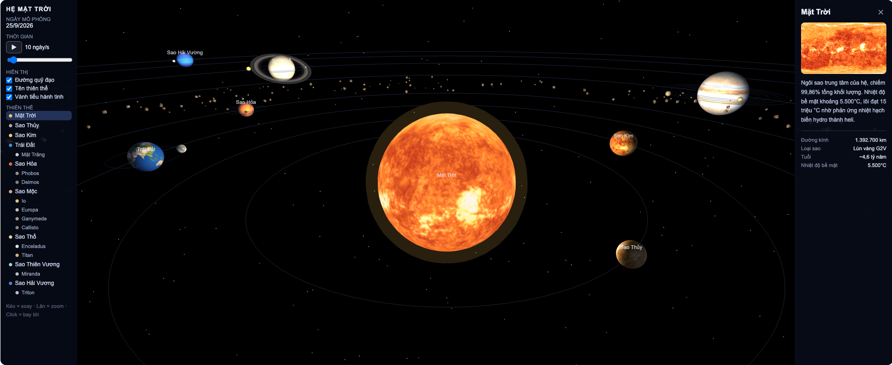
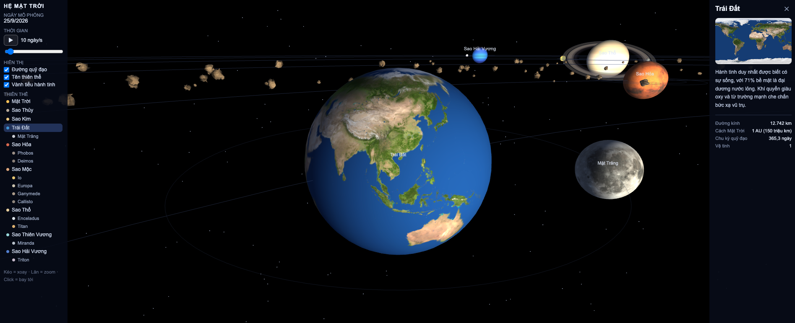

# 🪐 Mô phỏng Hệ Mặt Trời 3D

Tiếng Việt | [English](./README.md)

🔭 **[Xem trực tiếp](https://locnguyendata.com/solar-system-3d)**

Mô phỏng hệ mặt trời 3D tương tác chạy hoàn toàn trên trình duyệt — không cần cài đặt, không cần build. Chỉ cần mở file HTML là có thể khám phá Mặt Trời, 8 hành tinh, 11 vệ tinh lớn và vành đai tiểu hành tinh với ảnh bề mặt thật có nguồn gốc từ dữ liệu NASA.



## 🎥 Video demo

[](https://www.youtube.com/watch?v=9mrD3rWLZRU)

> ▶️ Bấm vào ảnh để xem video demo trên YouTube.

## ✨ Tính năng

- **Không gian 3D đầy đủ** dựng bằng Three.js — kéo chuột để xoay camera, lăn chuột để zoom
- **Bay tới thiên thể** — click vào bất kỳ thiên thể nào trong không gian 3D hoặc trong danh sách bên trái, camera sẽ bay mượt tới và bám theo nó trên quỹ đạo
- **Ảnh bề mặt thật** cho Mặt Trời, 8 hành tinh và các vệ tinh lớn (Io, Europa, Ganymede, Callisto, Titan, Triton, Mặt Trăng...)
- **Bảng giới thiệu** — chọn một thiên thể sẽ mở bảng bên phải gồm ảnh, đoạn giới thiệu ngắn và các thông số chính (đường kính, khoảng cách, chu kỳ quỹ đạo, số vệ tinh)
- **11 vệ tinh lớn** quay quanh hành tinh mẹ, bao gồm Phobos và Deimos với hình dạng củ khoai gồ ghề đúng thực tế
- **Vành đai tiểu hành tinh bằng đá 3D** — 260 khối đá với hình dạng và texture riêng trôi giữa Sao Hỏa và Sao Mộc, mỗi viên tự xoay quanh trục của mình
- **Vành đai Sao Thổ** dùng texture vành đai thật, thấy rõ các khe phân chia
- **Điều khiển thời gian** — tạm dừng/tiếp tục và chỉnh tốc độ mô phỏng từ 0 đến 200 ngày/giây, kèm hiển thị ngày mô phỏng theo thời gian thực
- **Tùy chọn hiển thị** — bật/tắt đường quỹ đạo, tên thiên thể và vành đai tiểu hành tinh
- **Tốc độ quỹ đạo tương đối chính xác** — Sao Thủy lao vun vút trong khi Sao Hải Vương chậm rãi, đúng theo tỷ lệ chu kỳ thật
- Có **hai phiên bản ngôn ngữ**: tiếng Anh (`index.html`) và tiếng Việt (`index.vi.html`)



## 🚀 Bắt đầu

Không cần cài đặt gì. Chỉ cần clone và mở:

```bash
git clone https://github.com/locphamnguyen/solar-system-3d.git
cd solar-system-3d
```

Sau đó mở `index.vi.html` (tiếng Việt) hoặc `index.html` (tiếng Anh) bằng bất kỳ trình duyệt hiện đại nào.

> **Lưu ý:** Cần kết nối internet ở lần tải đầu — Three.js và ảnh bề mặt hành tinh được tải từ CDN công cộng (cdnjs và jsDelivr). Nếu không có mạng, mô phỏng vẫn chạy nhưng các thiên thể sẽ hiển thị bằng màu đơn sắc thay thế.

Để có trải nghiệm tốt nhất, bạn cũng có thể chạy server cục bộ:

```bash
npx serve .
# hoặc
python3 -m http.server 8000
```

## 🎮 Điều khiển

| Thao tác | Tác dụng |
|---|---|
| Kéo chuột | Xoay camera quanh thiên thể đang chọn |
| Lăn chuột | Zoom vào / ra |
| Click thiên thể (3D hoặc danh sách) | Bay tới và bám theo thiên thể đó |
| Nút ❚❚ / ▶ | Tạm dừng / tiếp tục thời gian |
| Thanh trượt tốc độ | 0–200 ngày mô phỏng mỗi giây |
| Nút ✕ trên bảng giới thiệu | Đóng bảng giới thiệu |

## 🛠️ Công nghệ

- [Three.js r128](https://threejs.org/) — kết xuất WebGL
- HTML / CSS / JavaScript thuần — mỗi ngôn ngữ là một file độc lập duy nhất, không framework, không bundler
- Bộ điều khiển camera tọa độ cầu tự viết với hiệu ứng bay tới mượt mà
- Nhãn tên thiên thể là lớp DOM phủ trên canvas, được chiếu từ tọa độ 3D mỗi khung hình

## 📁 Cấu trúc dự án

```
.
├── index.html       # Phiên bản tiếng Anh
├── index.vi.html    # Phiên bản tiếng Việt
├── assets/          # Ảnh chụp dùng trong README
├── README.md        # README tiếng Anh (hiển thị ở trang chính GitHub)
└── README.vi.md     # File này (tiếng Việt)
```

## 🎨 Tùy biến

Toàn bộ dữ liệu thiên thể nằm trong một mảng ở đầu phần script — mỗi thiên thể là một object đơn giản:

```js
{
  name: 'Sao Hỏa',
  r: 1.7,           // bán kính hiển thị
  orbit: 64,         // bán kính quỹ đạo hiển thị
  period: 687,       // chu kỳ quỹ đạo thật (ngày)
  tex: 'mars.jpg',   // file texture bề mặt
  desc: '...',       // đoạn giới thiệu cho bảng thông tin
  stats: [...],      // các dòng thông số cho bảng thông tin
  moons: [...]       // các vệ tinh lồng bên trong
}
```

Muốn thêm hành tinh lùn, sao chổi hay vệ tinh mới, chỉ cần thêm object vào mảng này — quỹ đạo, nhãn tên, dòng trong danh sách và bảng giới thiệu đều được tạo tự động.

> Khoảng cách quỹ đạo và kích thước thiên thể được nén lại để dễ quan sát (theo tỷ lệ thật, Sao Hải Vương sẽ xa gấp ~30 lần Trái Đất). Tuy nhiên tỷ lệ chu kỳ quỹ đạo giữa các thiên thể là chính xác.

## 🙏 Ghi công

- Texture hành tinh và vệ tinh từ [KyleGough/solar-system](https://github.com/KyleGough/solar-system), phân phối qua jsDelivr — nguồn gốc từ ảnh NASA, [Solar System Scope](https://www.solarsystemscope.com/textures/) và [Planet Pixel Emporium](https://planetpixelemporium.com/)
- Xây dựng với [Three.js](https://threejs.org/)

### 🔊 Bản quyền âm thanh

- **NASA** — *Discovery – Nice to be in orbit* và *Discovery – STS-26 Liftoff*, từ [NASA Historical Sounds](https://www.nasa.gov/historical-sounds/)
- **Scott Buckley** — *'Song Of The Forge'* của Scott Buckley, phát hành theo giấy phép CC-BY 4.0 — [www.scottbuckley.com.au](https://www.scottbuckley.com.au/library/song-of-the-forge/)

## 📄 Giấy phép

Dự án phát hành theo giấy phép MIT — xem chi tiết tại [LICENSE](./LICENSE). Các tài nguyên texture vẫn thuộc điều khoản của tác giả gốc; vui lòng xem lại các nguồn được ghi công ở trên trước khi sử dụng cho mục đích thương mại.

## 🤝 Đóng góp

Mọi issue và pull request đều được hoan nghênh! Một số ý tưởng hay để bắt đầu đóng góp:

- Sao Diêm Vương và vành đai Kuiper
- Sao chổi với quỹ đạo elip và đuôi sao chổi
- Độ nghiêng trục quay thật (Sao Thiên Vương lăn nghiêng 98°!)
- Lớp mây và ánh đèn thành phố ban đêm cho Trái Đất
- Nút chuyển đổi ngôn ngữ Việt/Anh ngay trong giao diện (gộp một file)
- Điều khiển cảm ứng cho điện thoại
